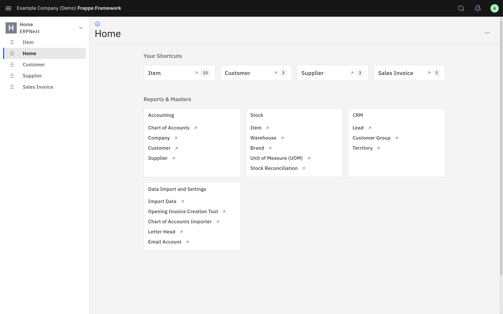
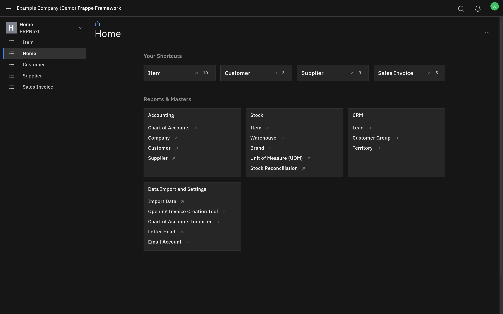
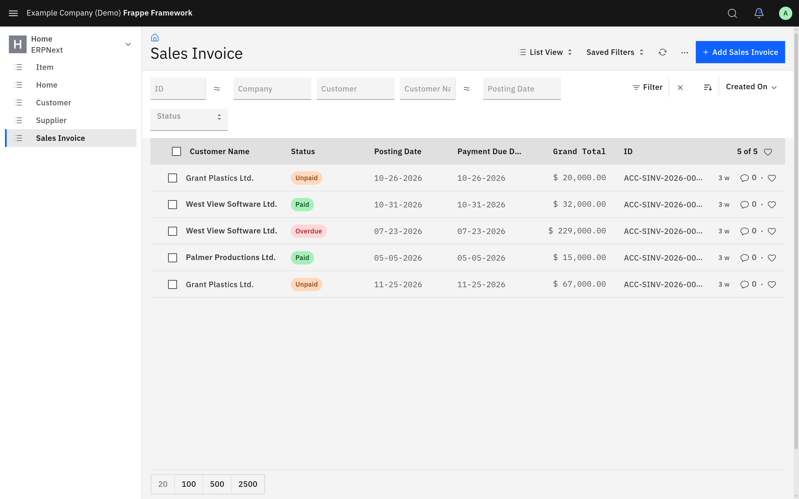
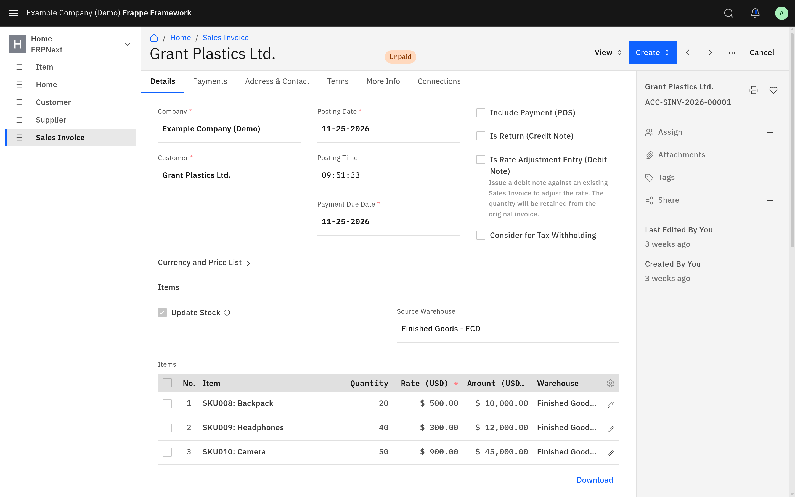
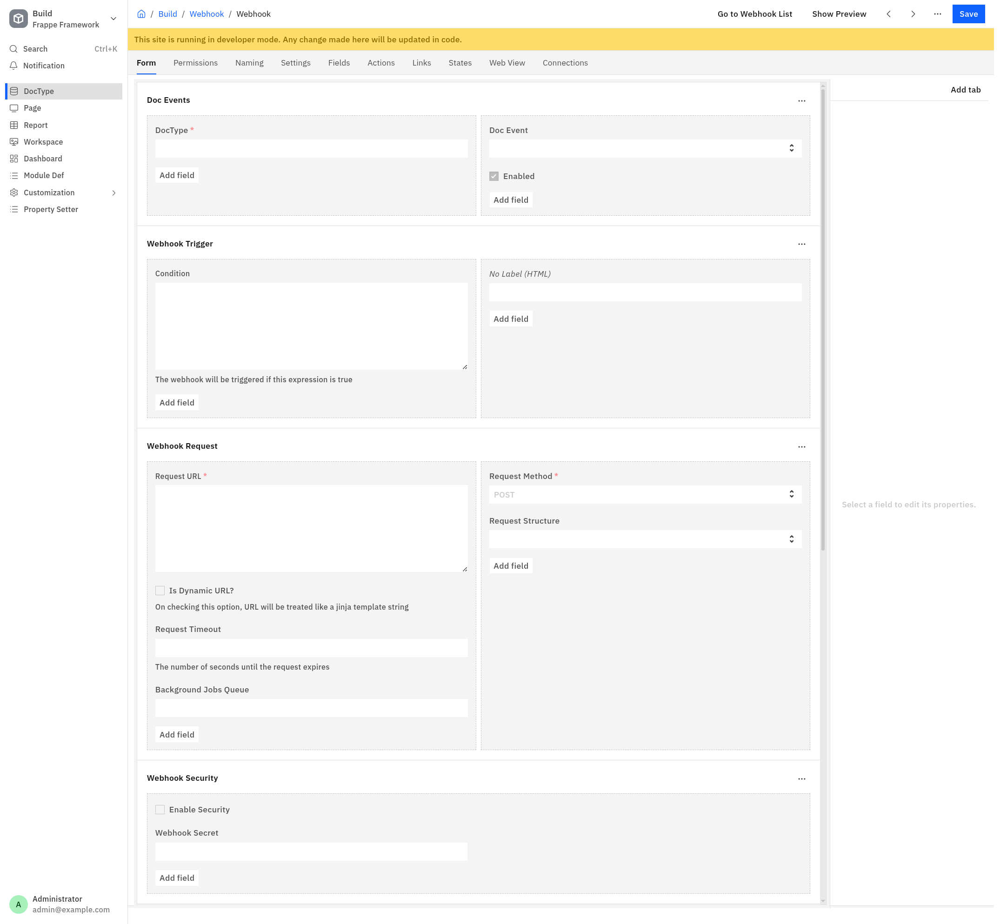
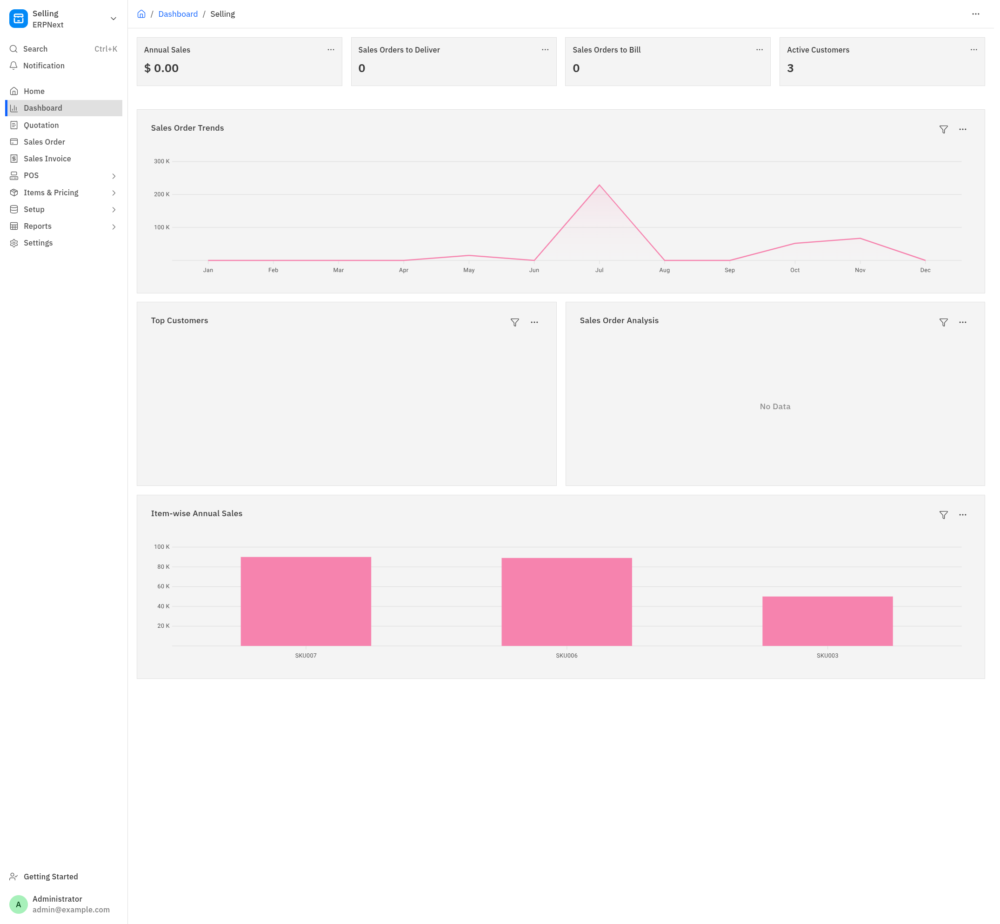

# Carbon Frappe

A comprehensive [Carbon Design System](https://carbondesignsystem.com) (v11) theme for [Frappe](https://frappeframework.com) sites. Every surface — desk, website/portal, login, email, charts, and frappe-ui/Espresso components — is restyled to look as though it was designed with Carbon: IBM Plex type, square geometry, Carbon color tokens, 2px focus rings, the g100 UI Shell header, and Carbon's categorical chart palettes, all sourced from the official `@carbon/*` npm packages.

## Screenshots

Workspace — the g100 UI Shell header sits above both themes; light and dark (`data-theme`, toggled from Settings → Toggle Theme) share the same tokens, so parity is automatic:

<table>
<tr>
<td></td>
<td></td>
</tr>
</table>

List view — Carbon data-table header, status tags on the 24px Carbon tag silhouette, bottom-border filter fields:



Document form — bottom-border fields, the Carbon button ramp in the page head, and the document sidebar:



Form Builder — the section/field nesting reads as distinct surfaces (canvas → card → field slot → input) instead of one flat gray block, with the field properties panel on the same field ramp:



Dashboard — square stat tiles, and charts rendered through the `carbon_charts.bundle.js` wrapper so series colors come from `@carbon/charts` categorical palettes (charts carrying an explicit per-chart color keep it):



Login — IBM Plex, square fields with the 2px Carbon focus ring, full-width 48px action:


## How it works

Frappe resolves every stylesheet through `sites/assets/assets.json`, keyed by bare bundle basename. This app **shadows** frappe's own bundles: it ships same-named entries (`desk.bundle.scss`, `website.bundle.scss`, `login.bundle.scss`, `email.bundle.scss`) that _recompile frappe's SCSS sources_ with Carbon values injected at compile time, then layer Carbon tokens and component overrides on top. The server is thereby forced to serve the Carbon stylesheets **instead of** frappe's — one stylesheet per surface, no double download, no cascade fights.

Three mechanisms keep the shadow deterministic:

1.  **Name collision** — this app builds after frappe, so its entries win the assets.json merge.
2.  **`scripts/patch-assets.mjs`** — runs as the app's `build` script after every full `bench build`; re-points the shadowed keys (and `rtl_` variants) at this app's compiled assets and clears the redis `assets_json` cache.
3.  **`after_migrate` hook** (`carbon_frappe.build.patch_assets`) — re-asserts the shadow after migrations, healing partial `bench build --apps frappe` runs.

Inside each bundle, the styling itself is a three-layer transposition:

-   **`scss/carbon/`** — emits Carbon's ~240 design tokens as `--cds-*` custom properties (Light → Carbon **g10**, Dark → Carbon **g100**, keyed to frappe's `data-theme`), plus self-hosted IBM Plex `@font-face` rules.
-   **`scss/map/`** — transposes frappe's variable system onto Carbon: the espresso raw color ramps (`--gray-*`, `--blue-*`, …) snap to `@carbon/colors` scales (which cascades through frappe's semantic `--surface-*`/`--ink-*`/`--outline-*` layer _and_ frappe-ui's identical token names), with exact-token pins for the slots that must land on Carbon theme tokens (`--bg-color → --cds-background`, `--control-bg → --cds-field-02`, `--btn-primary → blue-60`, radii → 0, focus → 2px `$focus`, elevations → Carbon's single menu shadow, type → IBM Plex).
-   **`scss/desk/` + `scss/web/`** — Carbon component anatomy: bottom-border fields, Carbon button ramps, the g100 UI Shell header, page actions flush on the title row, side-nav selection bars, 48px data tables, Carbon modals/menus/toasts/tags/tiles, and Carbon read-only states.

> **Why g10 and not White.** Carbon's product UIs put the page canvas on `$background` and lift cards, tiles and the side nav to `$layer-01`. The **White** theme inverts that ladder (`$background` `#ffffff` / `$layer-01` `#f4f4f4`), which renders as a white page with gray cards — the opposite of every Carbon reference product. **g10** gives `#f4f4f4` / `#ffffff`. The two themes differ in only 17 of 306 tokens, all in the `background` / `layer` / `field` / `border-subtle` family. Note `border-subtle-00`/`-01` **invert** between g10 and g100, so all subtle hairlines resolve through an app-level `--carbon-border-subtle` alias rather than a Carbon token directly.

Charts get `--charts-*` theming plus `carbon_charts.bundle.js`, which wraps `frappe.Chart` and injects the authentic `@carbon/charts` 14-color categorical palettes whenever a caller doesn't pass explicit colors, and re-themes those charts when `data-theme` changes (frappe fires no theme event, so this observes the attribute). Chart chrome follows Carbon rather than the concept mockup: gridlines stay (Carbon names the grid as comprehension anatomy) and both axes are IBM Plex **Sans**.

### Beyond CSS

Small JS bundles cover what stylesheets cannot reach. Every theme patch delegates to the original, never throws and never half-applies — a missing target degrades to stock frappe styling and reports itself, rather than throwing inside `desk.bundle.js`.

-   **`carbon_desk.bundle.js`** — tags formatter output with `carbon-num` so numerics and dates get IBM Plex Mono.
-   **`carbon_anatomy.bundle.js`** — the Carbon UI Shell header (mounted into the empty `<header>` frappe leaves in `www/desk.html`) and the page header (eyebrow + `heading-04` title, which has no host element in frappe).
-   **`carbon_tables.bundle.js`** — not a theme patch but a functional replacement: one Carbon-styled, TanStack-driven table engine behind frappe's child-table Grid, List view and Report/Query views. See _Tables_ below.
-   **`scripts/audit-markup.mjs`** — guards every selector, runtime shape and asset-shadow assumption the above depends on. See _Caveats_.

## Tables

`carbon_tables.bundle.js` replaces frappe's three unrelated table renderers — a Bootstrap 12-column grid, hand-built flex-div list rows, and the separate **frappe-datatable** library — with a single engine built on [TanStack Table](https://tanstack.com/table) v9 and rendered as Carbon's light-DOM `cds--data-table`.

**What it unlocks**

-   **Child-table grids past 10 columns.** frappe sizes grid fields as Bootstrap spans and stops redistributing once the total passes 10 (`grid.js:1357-1380`), then latches `.column-limit-reached` and swaps in a hand-rolled horizontal-scroll hack driven by a px map duplicated in JS and SCSS. Columns now carry real pixel widths owned by TanStack's column-sizing feature, the table scrolls horizontally like any table, and `df.sticky` becomes real column pinning. There is no cap.
-   **Virtualized report rows.** A 742-row report keeps ~32 rows in the DOM; the engine measured 50 000 rows rendering in ~400 ms.
-   **Column resizing, reordering, pinning and Carbon sort headers** on every surface, plus a spreadsheet-style cell-selection primitive (`cellSelectionFeature`) that frappe-datatable had and Carbon's own Datagrid does not.
-   **One row-size vocabulary.** Carbon has five row sizes and one rule — the header row matches the body row — so an arbitrary `cellHeight` (frappe asks for 33 and 35) snaps to the nearest and the header follows.

**What does not change**

Compatibility is the point. Nothing here alters a public frappe API:

-   **Grid** — `CarbonGrid extends Grid` and `CarbonGridRow extends GridRow`, overriding only the methods that produce or size DOM. `refresh()`, `add_new_row()`, `update_docfield_property()`, `get_field()`, bulk edit, CSV upload, Sortable row dragging, the Configure Columns dialog and the expanded row form are all frappe's own implementations running against new DOM. Cells are still the `div.grid-static-col` elements `GridRow.make_column()` builds, complete with their `.static-area` / `.field-area` pair and their mounted controls — the engine positions them, it never rebuilds them.
-   **Report and Query views** — `window.DataTable` and `frappe.DataTable` become a frappe-datatable-compatible facade. The option surface, the `getEditor` protocol, `events`, `hooks.columnTotal`, and the `datamanager` / `rowmanager` / `columnmanager` / `cellmanager` / `bodyRenderer` / `style` sub-managers are reproduced against measured call sites — including `style.setStyle()`, which 13 places across frappe, ERPNext and app reports use to paint individual cells.
-   **List view** — `get_column_html()` and `get_meta_html()` are reused verbatim as the cell renderers, so `listview_settings` (`formatters`, `get_indicator`, `button`, `dropdown_button`, `hide_name_column`) behaves exactly as before.
-   **The legacy DOM contract is re-emitted alongside Carbon's.** Every row and cell carries its `dt-*`, `grid-*` or `list-row-*` class as well, so existing app CSS, jQuery and `setStyle` selectors keep resolving. The mapping lives in one file per adapter (`tables/*/classes.js`).

**Known limits**

-   `frappe/data_import/import_preview.js` and `system_console.js` hold module-local `frappe-datatable` imports that a global reassignment cannot reach. They keep using the stock library, which remains installed and themed.
-   List-view rows are not virtualized: the list scrolls the page rather than an inner box, which is what frappe's paging buttons and `.disable-scrolling` assume. `page_length` (20/100/500/2500) remains the bound on row count.

## Install

```sh
bench get-app https://github.com/Avunu/carbon-frappe
bench --site <site> install-app carbon_frappe
bench build
```

`bench get-app` installs the npm dependencies (the app-root `package.json`); the SCSS imports `@carbon/styles` straight from the app's `node_modules`. If the first build fails with a missing-import error, run `bench setup requirements` (or simply re-run `bench build`) and build again.

### Verifying

-   `sites/assets/assets.json` → `"desk.bundle.css"` should point at `/assets/carbon_frappe/dist/css/…`
-   DevTools on `/app`: `--cds-background` present on `:root`; `--bg-color` resolves through the `--cds-*` chain; toggling the theme (Settings → Toggle Theme) flips token values and `color-scheme`.
-   Fonts: IBM Plex woff2 requests from `/assets/carbon_frappe/fonts/`; no Inter requests.

## Caveats (read before deploying)

-   **Bench-global**: assets.json is shared by every site on the bench, so the theme applies to sites that don't have the app installed. Run carbon\_frappe on a dedicated bench.
-   **Partial builds**: `bench build --apps frappe` re-points the shadowed keys at frappe's assets until the next full `bench build` or `bench migrate`. Prefer plain `bench build`.
-   **`bench watch`**: rebuilds of frappe's own bundles re-claim the keys mid-session. This is the most common way to lose the theme, and it has **no symptom other than stock frappe styling reappearing** — nothing errors. `npm run audit` now checks for it explicitly; the fix is `node scripts/patch-assets.mjs`.
-   The shadowing relies on frappe's (undocumented) basename keying and merge semantics of `assets.json`. The orthodox fallback — `app_include_css`/`web_include_css` hooks — remains structurally compatible with this app's bundles if the shadow mechanism ever breaks.

### Drift guards

Both run warn-only on every `bench build` and strict via `npm run audit`.

-   **`scripts/audit-tokens.mjs`** — Carbon token renames, removed frappe variables, changes to frappe's bundle entry imports, the g10 premise, and the frappe runtime shapes the theme patches.
-   **`scripts/audit-markup.mjs`** — every frappe class the stylesheet targets, every runtime shape `js/anatomy/*` wraps, the frappe declarations we deliberately override, and the asset shadow itself. Declared in `scripts/markup-manifest.mjs` so the guard and the code cannot drift apart.

These exist because all of these failures are silent: the theme keeps loading and a component quietly reverts to stock frappe styling.

### Deliberate deviations from Carbon

Recorded rather than claimed as conformance:

-   **IBM Plex Mono on tabular data.** Carbon is silent on numeric font and alignment in data tables. Monospaced tabular figures are a project choice for financial data; charts deliberately stay Plex Sans, matching Carbon's data-viz references.
-   **Light-DOM tables rather than `@carbon/web-components`.** Carbon's own TanStack transition ships React and Web Component examples, and the Web Component set would have been the closer fit for an app that uses no framework. It was rejected for three reasons: `@tanstack/lit-table` is pinned to TanStack v8, which has no `cellSelectionFeature` (the primitive that reproduces frappe-datatable's range selection and `ctrl+C`); `@carbon/web-components` compiles its own copy of Carbon's SCSS into each component's shadow root, which is a second Carbon delivery channel alongside the pinned `@carbon/styles`; and shadow roots would put row and cell internals out of reach of `datatable.style.setStyle()` and of every third-party report stylesheet. `@carbon/styles/scss/components/data-table` gives the identical appearance in the light DOM — it is what `@carbon/react` renders.

## frappe-ui SPA apps

Apps that build their own bundles (CRM, Helpdesk, custom portals) can't be reached by the bench pipeline. For those, this app publishes a standalone tokens-only stylesheet — `carbon_frappe_ui.bundle.css` — that re-themes frappe-ui's semantic variables (unlayered, so it beats Tailwind's `@layer base` regardless of order) and covers frappe-ui's hardcoded utility classes. Resolve the hashed path via the `"carbon_frappe_ui.bundle.css"` key in `sites/assets/assets.json` and include it after the app's own CSS.

## Email

-   The `email.bundle` shadow is Premailer-inlined into outgoing mail — literal values only (no CSS-variable support in that pipeline).

## Development

```sh
yarn run compile      # compile all bundles against a sibling ../frappe checkout (.dev-dist/)
yarn run codegen      # refresh vendored IBM Plex fonts + @carbon/charts palettes
yarn run audit        # strict drift audit (CI)
yarn run test:tables  # browser tests for the table engine and its adapters
node scripts/dev-table.mjs --serve   # the engine alone, on :8123, with no bench
```

`scripts/test-tables.mjs` drives headless Chromium over the DevTools Protocol (no
dependencies beyond Node 22+ and `chromium` on PATH) against a running bench. It
covers the engine in isolation, then each adapter's frappe contract: the `dt-*`
selectors, `style.setStyle`, `rowmanager.getCheckedRows`, a report script's
`get_datatable_options` / `formatter` / `after_datatable_render` / `getEditor`
hooks, the Grid's inherited API and its >10-column layout, the List view's bulk
actions, and g100 parity. Most of those assertions exist because that exact thing
regressed once — several are specificity guards against frappe-datatable's,
Bootstrap's or Carbon's own stylesheet quietly winning.

`scripts/dev-table.mjs` builds the engine and a fixture page into `.dev-dist/`
with no frappe present at all, which is where engine behaviour is verified before
any adapter is involved.

`scripts/dev-compile.mjs` replicates frappe's exact sass pipeline (legacy API, `includePaths` = app roots + node\_modules, `~` importer), so bundles can be smoke-tested without a bench. Set `FRAPPE_PATH` if frappe isn't at `../frappe`.

### Upgrading Carbon

Bump the exact-pinned `@carbon/*` versions, then `npm install && npm run codegen && npm run audit && npm run compile`, review the diff, and do a visual pass in both themes.

## License

MIT — see `license.txt`. IBM Plex is vendored under the OFL (see `carbon_frappe/public/fonts/LICENSE-*.txt`).
